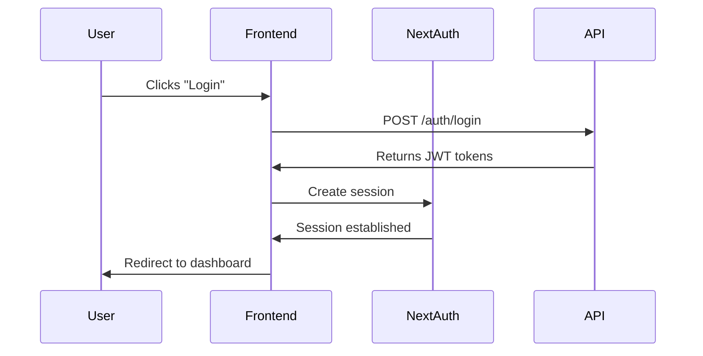
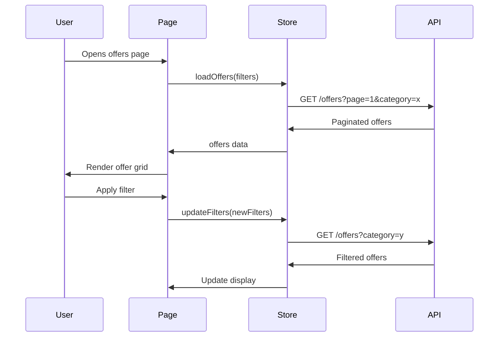
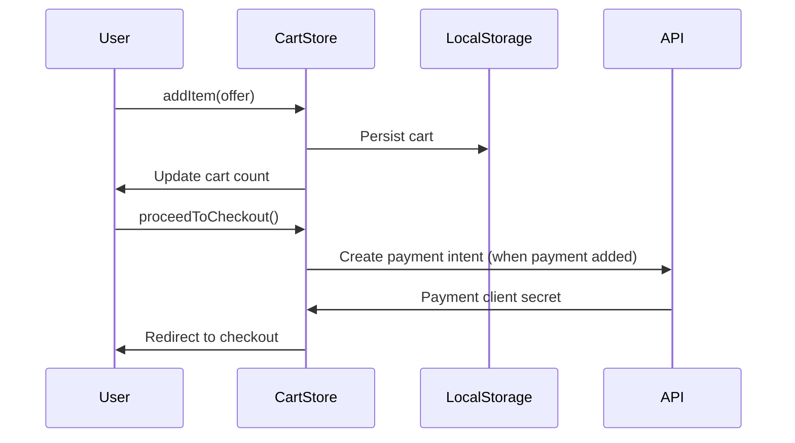
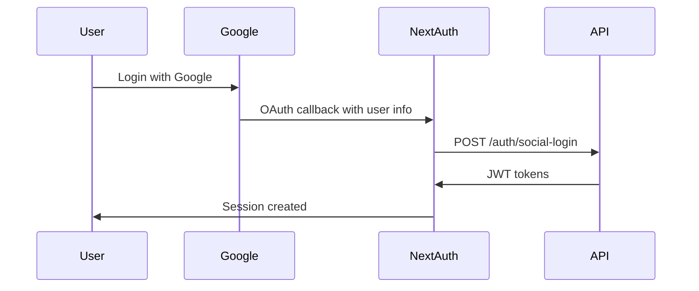

# CouponWala Frontend Architecture Document

## Table of Contents
1. [Overview](#overview)
2. [Technology Stack](#technology-stack)
3. [Project Structure](#project-structure)
4. [Page Structure & Routing](#page-structure--routing)
5. [Component Architecture](#component-architecture)
6. [State Management](#state-management)
7. [API Integration Layer](#api-integration-layer)
8. [Authentication Strategy](#authentication-strategy)
9. [Data Flow](#data-flow)
10. [Environment Configuration](#environment-configuration)

---

## Overview

CouponWala is a web application for discovering and purchasing discount offers/coupons. The frontend will be built with Next.js 14+ using the App Router, providing server-side rendering, static generation, and optimal performance.

### Core Features
- User authentication (email/password with social login support)
- Browse and search offers with filters
- Shopping cart/bag functionality
- Offer detail pages with redemption options
- User profile management
- Checkout flow (payment integration ready)

---

## Technology Stack

| Technology | Purpose | Justification |
|------------|---------|---------------|
| **Next.js 16** | React Framework | App Router, Server Components, SSR/SSG support, built-in optimization |
| **React 19** | UI Library | Latest features, improved performance, concurrent rendering |
| **TypeScript 5** | Type Safety | Compile-time error detection, better IDE support, maintainable code |
| **Tailwind CSS 4** | Styling | Utility-first, low bundle size, rapid UI development, easy customization |
| **Zustand** | State Management | Simple, lightweight, no boilerplate, works with SSR |
| **NextAuth.js** | Authentication | Built-in social providers, flexible, secure session handling |
| **React Hook Form** | Form Handling | Performance, validation with Zod, minimal re-renders |
| **Zod** | Validation | Type-safe schema validation, integrates well with TypeScript |
| **Axios** | HTTP Client | Request/response interceptors, automatic transforms, easy testing |
| **Lucide React** | Icons | Lightweight, consistent design, tree-shakeable |

### Why Not Other Options?

- **Redux**: Too much boilerplate for this scale; Zustand is simpler and sufficient
- **Firebase**: Not required per requirements; backend API already exists
- **Context API**: Zustand provides better performance and easier debugging
- **Material UI / AntD**: Tailwind provides more flexibility and smaller bundle size

---

## Project Structure

```
frontend/
├── app/                          # Next.js App Router
│   ├── (auth)/                   # Auth route group (no layout)
│   │   ├── login/
│   │   │   ├── page.tsx
│   │   │   └── components/
│   │   └── signup/
│   │       ├── page.tsx
│   │       └── components/
│   ├── (main)/                   # Main app route group (with header/footer)
│   │   ├── layout.tsx            # Main layout with header/footer
│   │   ├── page.tsx              # Homepage
│   │   ├── offers/
│   │   │   ├── page.tsx          # Offers listing
│   │   │   └── [id]/
│   │   │       └── page.tsx      # Offer detail
│   │   ├── cart/
│   │   │   └── page.tsx          # Shopping bag
│   │   ├── checkout/
│   │   │   └── page.tsx          # Checkout page
│   │   └── profile/
│   │       ├── page.tsx          # User profile
│   │       └── components/
│   ├── api/                      # API routes (if needed for SSR)
│   │   └── auth/
│   │       └── [...nextauth]/    # NextAuth handler
│   ├── globals.css               # Global styles
│   ├── layout.tsx                # Root layout
│   └── not-found.tsx             # 404 page
├── components/
│   ├── ui/                       # Base UI components
│   │   ├── Button.tsx
│   │   ├── Input.tsx
│   │   ├── Card.tsx
│   │   ├── Modal.tsx
│   │   ├── Badge.tsx
│   │   ├── Skeleton.tsx
│   │   ├── Select.tsx
│   │   ├── Checkbox.tsx
│   │   ├── RadioGroup.tsx
│   │   ├── Toast.tsx
│   │   └── Dropdown.tsx
│   ├── layout/                   # Layout components
│   │   ├── Header.tsx
│   │   ├── Footer.tsx
│   │   ├── Navigation.tsx
│   │   ├── MobileMenu.tsx
│   │   └── PageContainer.tsx
│   ├── offers/                   # Offer-related components
│   │   ├── OfferCard.tsx
│   │   ├── OfferGrid.tsx
│   │   ├── OfferFilters.tsx
│   │   ├── OfferSearch.tsx
│   │   ├── FeaturedOffers.tsx
│   │   └── OfferDetail.tsx
│   ├── cart/                     # Cart components
│   │   ├── CartItem.tsx
│   │   ├── CartSummary.tsx
│   │   ├── CartEmpty.tsx
│   │   └── CartQuantity.tsx
│   ├── auth/                     # Auth components
│   │   ├── SocialLogin.tsx
│   │   ├── LoginForm.tsx
│   │   ├── SignupForm.tsx
│   │   ├── ForgotPassword.tsx
│   │   └── AuthLayout.tsx
│   ├── checkout/                 # Checkout components
│   │   ├── CheckoutForm.tsx
│   │   ├── PaymentMethod.tsx
│   │   ├── OrderSummary.tsx
│   │   └── AddressForm.tsx
│   └── profile/                  # Profile components
│       ├── UserInfo.tsx
│       ├── OrderHistory.tsx
│       ├── SavedOffers.tsx
│       └── Settings.tsx
├── contexts/                     # React contexts
│   ├── AuthContext.tsx
│   └── CartContext.tsx
├── hooks/                        # Custom hooks
│   ├── useAuth.ts
│   ├── useCart.ts
│   ├── useOffers.ts
│   ├── useDebounce.ts
│   ├── useLocalStorage.ts
│   └── useMediaQuery.ts
├── lib/                          # Utilities and configurations
│   ├── api/
│   │   ├── client.ts             # Axios instance
│   │   ├── endpoints.ts          # API endpoints
│   │   └── types.ts              # API types
│   ├── auth/
│   │   ├── options.ts            # NextAuth options
│   │   └── utils.ts              # Auth utilities
│   ├── utils.ts                  # Helper functions
│   └── validators.ts             # Zod schemas
├── stores/                       # Zustand stores
│   ├── useAuthStore.ts
│   └── useCartStore.ts
├── types/                        # TypeScript types
│   ├── api.ts                    # API response types
│   ├── auth.ts                   # Auth types
│   ├── cart.ts                   # Cart types
│   ├── offers.ts                 # Offer types
│   └── user.ts                   # User types
├── public/                       # Static assets
│   ├── images/
│   ├── icons/
│   └── fonts/
├── .env.local                    # Environment variables
├── next.config.ts                # Next.js configuration
├── tailwind.config.ts            # Tailwind configuration
├── tsconfig.json                 # TypeScript configuration
└── package.json
```

---

## Page Structure & Routing

### Route Hierarchy

```
/                           → Homepage (featured offers)
├── login                   → Login page
├── signup                  → Signup page
├── offers                  → Offers listing with filters
│   └── [id]               → Offer detail page
├── cart                    → Shopping bag
├── checkout                → Checkout (no payment)
└── profile                 → User profile
    └── settings            → Profile settings
```

### Page Descriptions

| Route | File | Description |
|-------|------|-------------|
| `/` | `app/(main)/page.tsx` | Homepage with featured offers, hero section, categories |
| `/login` | `app/(auth)/login/page.tsx` | Login form with email/password and social buttons |
| `/signup` | `app/(auth)/signup/page.tsx` | Registration form with email/password |
| `/offers` | `app/(main)/offers/page.tsx` | Paginated offer listing with filter sidebar |
| `/offers/[id]` | `app/(main)/offers/[id]/page.tsx` | Detailed offer view with redemption |
| `/cart` | `app/(main)/cart/page.tsx` | Shopping bag with items and summary |
| `/checkout` | `app/(main)/checkout/page.tsx` | Checkout flow (address, review) |
| `/profile` | `app/(main)/profile/page.tsx` | User profile and order history |

### Route Groups

Using Next.js route groups `(auth)` and `(main)` to:
- Apply different layouts to auth pages (no header/footer)
- Keep main app pages with consistent layout
- Organize code logically

---

## Component Architecture

### Component Hierarchy

```
RootLayout
├── Providers (SessionProvider, ToastProvider)
├── AuthLayout (for /login, /signup)
│   └── SocialLogin
│   └── LoginForm / SignupForm
└── MainLayout (for all other pages)
    ├── Header
    │   ├── Logo
    │   ├── Navigation
    │   ├── SearchBar
    │   └── CartIcon
    ├── PageContainer
    │   └── PageContent
    │       ├── Homepage
    │       │   ├── Hero
    │       │   ├── FeaturedOffers
    │       │   └── Categories
    │       ├── OffersPage
    │       │   ├── OfferFilters
    │       │   └── OfferGrid
    │       │       └── OfferCard
    │       ├── OfferDetail
    │       │   ├── OfferInfo
    │       │   └── RedeemButton
    │       ├── CartPage
    │       │   ├── CartItem
    │       │   └── CartSummary
    │       ├── CheckoutPage
    │       │   ├── AddressForm
    │       │   └── OrderSummary
    │       └── ProfilePage
    │           ├── UserInfo
    │           └── OrderHistory
    └── Footer
```

### Component Categories

#### 1. Base UI Components (`components/ui/`)
Reusable, dumb components with no business logic.

- **Button.tsx** - Primary, secondary, outline, ghost variants
- **Input.tsx** - Text input with label, error states
- **Card.tsx** - Container with variants (elevated, outlined)
- **Modal.tsx** - Dialog component with portal
- **Badge.tsx** - Status labels, pills
- **Skeleton.tsx** - Loading placeholders
- **Select.tsx** - Dropdown selection
- **Checkbox.tsx** / **RadioGroup.tsx** - Form controls
- **Toast.tsx** - Notifications
- **Dropdown.tsx** - Menu dropdown

#### 2. Layout Components (`components/layout/`)
Structural components for page layout.

- **Header.tsx** - Top navigation with logo, nav, cart icon
- **Footer.tsx** - Site footer with links
- **Navigation.tsx** - Main navigation menu
- **MobileMenu.tsx** - Responsive mobile menu
- **PageContainer.tsx** - Consistent page width wrapper

#### 3. Feature Components (`components/offers/`, `components/cart/`, etc.)
Domain-specific components with business logic.

#### 4. Page Components (`app/(main)/.../page.tsx`)
Composite components that assemble feature components.

---

## State Management

### State Categories

1. **Server State** - Data from API (offers, users, etc.)
   - Managed with React Query (TanStack Query) or SWR
   - Cached, auto-refetched, optimistic updates

2. **Client State** - UI state, user interactions
   - Managed with Zustand
   - Cart, auth session, toast notifications

3. **Form State** - Form data and validation
   - Managed with React Hook Form + Zod

### Zustand Stores

#### Auth Store (`stores/useAuthStore.ts`)
```typescript
interface AuthState {
  user: User | null;
  isAuthenticated: boolean;
  isLoading: boolean;
  login: (credentials: LoginParams) => Promise<void>;
  logout: () => Promise<void>;
  updateProfile: (data: ProfileUpdateParams) => Promise<void>;
}
```

#### Cart Store (`stores/useCartStore.ts`)
```typescript
interface CartState {
  items: CartItem[];
  addItem: (offer: Offer) => void;
  removeItem: (offerId: string) => void;
  updateQuantity: (offerId: string, quantity: number) => void;
  clearCart: () => void;
  getTotal: () => number;
  getItemCount: () => number;
}
```

### Context Providers

#### Auth Context (`contexts/AuthContext.tsx`)
- Wraps app with session provider
- Provides auth methods to components
- Handles token refresh automatically

#### Cart Context (`contexts/CartContext.tsx`)
- Persists cart to localStorage
- Syncs cart state across tabs
- Calculates totals

---

## API Integration Layer

### Axios Client Configuration (`lib/api/client.ts`)

```typescript
const api = axios.create({
  baseURL: process.env.NEXT_PUBLIC_API_URL,
  timeout: 10000,
  headers: {
    'Content-Type': 'application/json',
  },
});

// Request interceptor - add auth token
api.interceptors.request.use((config) => {
  const token = getAccessToken();
  if (token) {
    config.headers.Authorization = `Bearer ${token}`;
  }
  return config;
});

// Response interceptor - handle errors and token refresh
api.interceptors.response.use(
  (response) => response,
  async (error) => {
    if (error.response?.status === 401) {
      // Attempt to refresh token
      const refreshed = await refreshToken();
      if (refreshed) {
        // Retry original request
        return api.request(error.config);
      }
      // Redirect to login
      window.location.href = '/login';
    }
    return Promise.reject(error);
  }
);
```

### API Endpoints (`lib/api/endpoints.ts`)

```typescript
export const endpoints = {
  auth: {
    login: '/auth/login',
    register: '/auth/register',
    logout: '/auth/logout',
    refresh: '/auth/refresh',
    profile: '/auth/profile',
  },
  offers: {
    list: '/offers',
    featured: '/offers/featured',
    byId: (id: string) => `/offers/${id}`,
    byCategory: (category: string) => `/offers/category/${category}`,
    byStore: (store: string) => `/offers/store/${store}`,
    redeem: (id: string) => `/offers/${id}/redeem`,
  },
  payments: {
    createIntent: '/payments/create-payment-intent',
    confirm: '/payments/confirm',
    history: '/payments',
    methods: '/payments/payment-methods',
  },
};
```

### API Service Layer (`lib/api/services/`)

Organized by domain for maintainability:

```
lib/api/services/
├── authService.ts
├── offersService.ts
├── paymentsService.ts
└── userService.ts
```

Example:
```typescript
// offersService.ts
import api from '../client';
import { Offer, PaginatedResponse } from '../types';

export const offersService = {
  getAll: (params: OfferFilters) => 
    api.get<PaginatedResponse<Offer>>('/offers', { params }),
  
  getFeatured: () => 
    api.get<Offer[]>('/offers/featured'),
  
  getById: (id: string) => 
    api.get<Offer>(`/offers/${id}`),
  
  redeem: (id: string) => 
    api.post(`/offers/${id}/redeem`),
};
```

### Type Definitions (`types/api.ts`)

```typescript
export interface Offer {
  id: string;
  serviceName: string;
  description: string;
  originalPrice: number;
  discountedPrice: number;
  discountPercentage: number;
  category: string;
  store: string;
  couponCode: string;
  imageUrl?: string;
  isActive: boolean;
  createdAt: string;
}

export interface PaginatedResponse<T> {
  data: T[];
  meta: {
    total: number;
    page: number;
    limit: number;
    totalPages: number;
  };
}

export interface User {
  id: string;
  email: string;
  name: string;
  avatar?: string;
  createdAt: string;
}
```

---

## Authentication Strategy

### Current API Capabilities
- JWT-based authentication
- Email/password login
- Token refresh endpoint
- User profile endpoint

### Social Login Strategy

Since the API only supports email/password, we'll use **NextAuth.js** with a **Credentials provider** as a bridge:

#### Flow for Social Login

```
User clicks "Login with Google"
    ↓
NextAuth handles OAuth flow with Google
    ↓
Google returns user info (email, name, picture)
    ↓
Frontend calls API to create/link account:
    - If email exists → link social to existing account
    - If email doesn't exist → create new account with social email
    ↓
API returns JWT tokens
    ↓
Session established in NextAuth
    ↓
User redirected to app
```

#### Implementation

**NextAuth Configuration (`lib/auth/options.ts`):**

```typescript
import GoogleProvider from 'next-auth/providers/google';
import CredentialsProvider from 'next-auth/providers/credentials';

export const authOptions = {
  providers: [
    GoogleProvider({
      clientId: process.env.GOOGLE_CLIENT_ID!,
      clientSecret: process.env.GOOGLE_CLIENT_SECRET!,
    }),
    FacebookProvider({
      clientId: process.env.FACEBOOK_CLIENT_ID!,
      clientSecret: process.env.FACEBOOK_CLIENT_SECRET!,
    }),
    CredentialsProvider({
      name: 'credentials',
      credentials: {
        email: { label: 'Email', type: 'email' },
        password: { label: 'Password', type: 'password' },
      },
      async authorize(credentials) {
        const response = await fetch(`${API_URL}/auth/login`, {
          method: 'POST',
          headers: { 'Content-Type': 'application/json' },
          body: JSON.stringify(credentials),
        });
        
        if (!response.ok) throw new Error('Invalid credentials');
        return response.json();
      },
    }),
  ],
  callbacks: {
    async signIn({ user, account }) {
      // For social providers, sync with backend
      if (account?.provider !== 'credentials') {
        await syncSocialAccount(user, account);
      }
      return true;
    },
    async jwt({ token, user, account }) {
      // Store tokens for API calls
      if (account) {
        token.accessToken = account.access_token;
        token.refreshToken = account.refresh_token;
      }
      return token;
    },
    async session({ session, token }) {
      session.accessToken = token.accessToken as string;
      return session;
    },
  },
};
```

#### Token Management

- Store JWT tokens in session (encrypted)
- Use session token for API calls
- NextAuth handles session refresh automatically
- On session expiration, redirect to login

---

## Data Flow

### User Authentication Flow



### Offer Browsing Flow



### Cart Management Flow



### Social Login Flow



---

## Environment Configuration

### Environment Variables (`.env.local`)

```env
# API Configuration
NEXT_PUBLIC_API_URL=http://localhost:3001

# NextAuth
NEXTAUTH_URL=http://localhost:3000
NEXTAUTH_SECRET=your-secret-key-here

# Google OAuth
GOOGLE_CLIENT_ID=your-google-client-id
GOOGLE_CLIENT_SECRET=your-google-client-secret

# Facebook OAuth
FACEBOOK_CLIENT_ID=your-facebook-app-id
FACEBOOK_CLIENT_SECRET=your-facebook-app-secret

# Stripe (for future)
NEXT_PUBLIC_STRIPE_PUBLISHABLE_KEY=pk_test_xxx
```

### Type Safety for Environment Variables

```typescript
// lib/env.ts
import { z } from 'zod';

const envSchema = z.object({
  NEXT_PUBLIC_API_URL: z.string().url(),
  NEXTAUTH_URL: z.string().url(),
  NEXTAUTH_SECRET: z.string().min(1),
  GOOGLE_CLIENT_ID: z.string().min(1),
  GOOGLE_CLIENT_SECRET: z.string().min(1),
  FACEBOOK_CLIENT_ID: z.string().min(1),
  FACEBOOK_CLIENT_SECRET: z.string().min(1),
  NEXT_PUBLIC_STRIPE_PUBLISHABLE_KEY: z.string().optional(),
});

export const env = envSchema.parse(process.env);
```

---

## Implementation Priority

### Phase 1: Core Features
1. Set up project structure
2. Implement UI components library
3. Create API integration layer
4. Build auth context and login/signup pages
5. Implement offers listing and detail pages
6. Build shopping cart functionality

### Phase 2: User Features
1. User profile page
2. Order history
3. Checkout flow (without payment)

### Phase 3: Enhancements
1. Social login integration
2. Advanced filters and search
3. Toast notifications
4. Loading states and error handling
5. Performance optimization

---

## Key Files Reference

| File | Purpose |
|------|---------|
| `app/layout.tsx` | Root layout with providers |
| `app/(main)/layout.tsx` | Main layout with header/footer |
| `components/ui/Button.tsx` | Reusable button component |
| `components/ui/Input.tsx` | Reusable input component |
| `lib/api/client.ts` | Axios instance with interceptors |
| `lib/auth/options.ts` | NextAuth configuration |
| `stores/useAuthStore.ts` | Authentication state |
| `stores/useCartStore.ts` | Shopping cart state |
| `types/index.ts` | Shared type definitions |

---

## Conclusion

This architecture provides a scalable, maintainable foundation for CouponWala frontend:

- **Modular structure** for easy navigation and code organization
- **Type safety** throughout with TypeScript and Zod
- **State management** optimized with Zustand and React Query
- **Authentication** ready for social login via NextAuth
- **API integration** with robust error handling and token management
- **Performance** through Next.js App Router and Server Components
